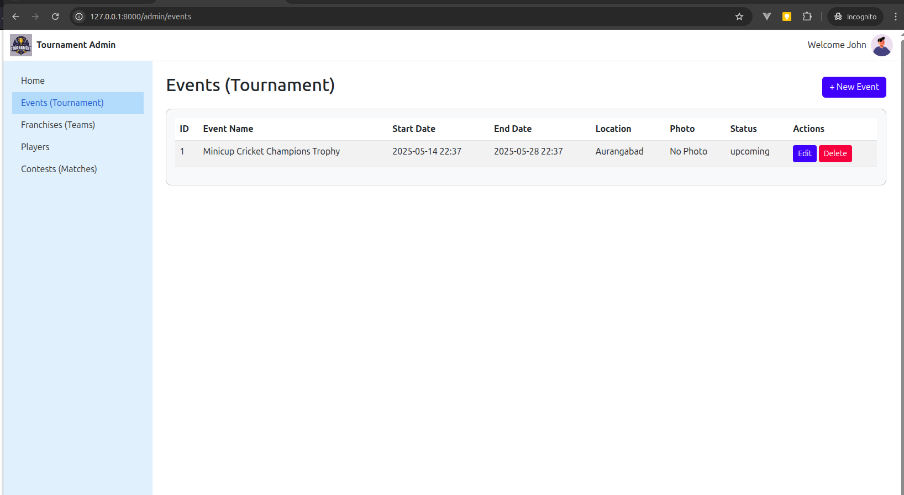
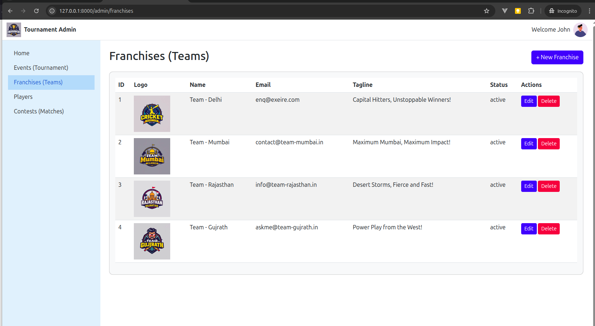
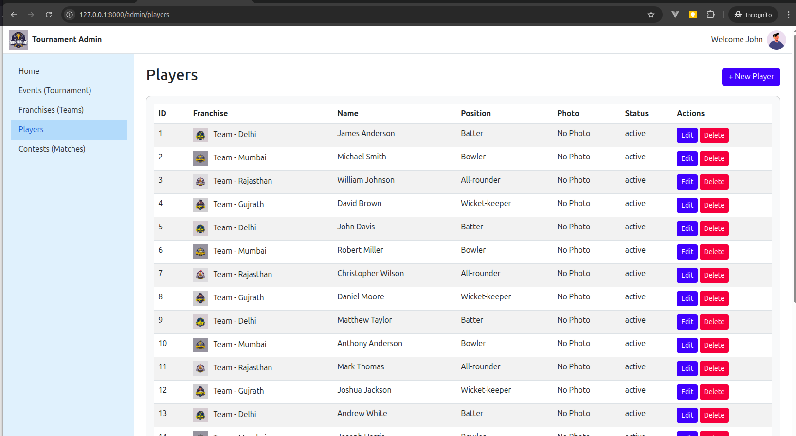
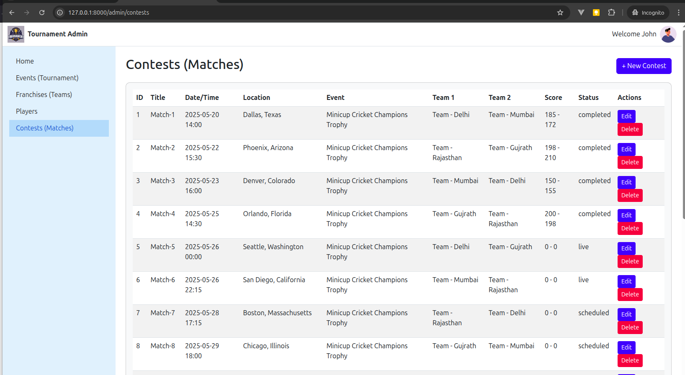

# Tournament-Admin-Laravel
Tournament Admin Panel using Laravel

**Tournament Admin** is a web-based admin panel built with Laravel 12 to manage tournaments and events, such as sports leagues, competitions, or any organized activities. It provides a robust interface for administrators to oversee franchises (teams), players, events, and contests (matches) between teams. Designed for flexibility, this application is ideal for any tournament or event management system, from basketball leagues to e-sports, school competitions, or corporate events.

The project features a clean, responsive UI powered by Bootstrap 5 and jQuery, with AJAX-driven CRUD operations for seamless user experience. It supports scheduling contests between two franchises, tracking event statuses, and maintaining detailed records of teams and players, making it a comprehensive solution for tournament organizers.

## Features

### 1. **Franchise (Team) Management**
- **Create/Edit/Delete Franchises**: Admins can add new teams with details like name, logo, location, and status (active/inactive).
- **Dynamic Team Profiles**: Store and update team information, including contact details and logos, with file uploads for images.
- **Soft Deletion**: Mark teams as inactive instead of permanent deletion to preserve data integrity.
- **Use Case**: Manage teams like basketball franchises, football clubs, or e-sports squads.

### 2. **Player Management**
- **Player Profiles**: Add, edit, or remove players with details such as name, team (franchise) affiliation, position, and stats.
- **Team Association**: Link players to specific franchises, ensuring accurate roster management.
- **Status Tracking**: Monitor player status (e.g., active, injured) for tournament planning.
- **Use Case**: Track athletes, gamers, or participants in any team-based competition.

### 3. **Event Management**
- **Event Scheduling**: Create and manage events (tournaments, leagues, or single matches) with fields for:
    - Event name
    - Start and end dates (using `datetime-local` for precise scheduling)
    - Location
    - Event photo (optional)
    - YouTube link (optional)
    - Status (upcoming, ongoing, completed)
- **Photo Uploads**: Attach images to events for promotional purposes.
- **Soft Deletion**: Mark events as completed instead of deleting, preserving historical data.
- **Use Case**: Organize tournaments, festivals, or any time-bound events with associated teams.

### 4. **Contest (Match) Management**
- **Schedule Contests**: Create matches between two franchises (teams) with details:
    - Contest title
    - Date and time (`match_datetime`)
    - Location
    - Associated event (linked to an event)
    - Team 1 and Team 2 (selected from active franchises)
    - Scores for both teams
    - Status (scheduled, live, completed)
- **Validation**: Ensure Team 1 and Team 2 are different and linked to valid franchises and events.
- **Score Tracking**: Update scores for live or completed contests, displayed as "Team1Score - Team2Score".
- **Soft Deletion**: Mark contests as completed instead of permanent deletion.
- **Use Case**: Schedule and track matches in sports leagues, debate competitions, or gaming tournaments.

### 5. **Admin Dashboard**
- **Overview Statistics**:
    - Total number of franchises (teams).
    - Count of past, today’s, and upcoming events (based on `event_start`).
    - List of the 5 most recent contests with team names, date/time, and status.
- **Real-Time Insights**: Provides admins with a quick snapshot of tournament activities.
- **Use Case**: Monitor tournament progress and key metrics at a glance.

### 6. **User Interface**
- **Responsive Design**: Built with Bootstrap 5 for a mobile-friendly admin panel.
- **AJAX-Powered CRUD**: Seamless create, read, update, and delete operations without page reloads.
- **Intuitive Navigation**: Sidebar with links to manage franchises, players, events, and contests.
- **Form Validation**: Client and server-side validation to prevent errors (e.g., duplicate teams, invalid dates).
- **Photo Previews**: Real-time previews for uploaded images (franchise logos, event photos).

### 7. **Data Integrity**
- **Foreign Key Constraints**: Ensures contests are linked to valid events and franchises, with cascading deletes.
- **Soft Deletes**: Preserves data by marking records as inactive/completed instead of hard deletion.
- **Database Schema**:
    - `franchises`: Stores team details (name, logo, location, status).
    - `players`: Stores player details (name, franchise_id, position, stats).
    - `events`: Stores event details (event_name, event_start, event_end, event_location, event_photo, event_status).
    - `contests`: Stores match details (match_title, match_datetime, match_location, event_id, franchises_1_id, franchises_2_id, score_1, score_2, status).

## Tech Stack
- **Backend**: Laravel 12 (PHP 8.2+)
- **Frontend**: Blade templates, Bootstrap 5, jQuery 3.6
- **Database**: MySQL (with migrations for `franchises`, `players`, `events`, `contests`)
- **Other**: AJAX for dynamic interactions, CSRF protection, file uploads for images

## Installation

### Prerequisites
- PHP 8.2 or higher
- Composer
- MySQL or another compatible database
- Node.js and npm (for frontend assets)
- Git

### Steps
1. **Clone the Repository**:
   ```bash
   git clone https://github.com/ajayashokgokhale/Tournament-Admin-Laravel.git
   cd tournament-admin
   ```

2. **Install Dependencies**:
   ```bash
   composer install
   npm install
   ```

3. **Configure Environment**:
    - Copy the `.env.example` file to `.env`:
      ```bash
      cp .env.example .env
      ```
    - Update `.env` with your database credentials:
      ```env
      DB_CONNECTION=mysql
      DB_HOST=127.0.0.1
      DB_PORT=3306
      DB_DATABASE=tournament_admin
      DB_USERNAME=your_username
      DB_PASSWORD=your_password
      ```
    - Generate an application key:
      ```bash
      php artisan key:generate
      ```

4. **Run Migrations**:
    - Create the database in MySQL (e.g., `tournament_admin`).
    - Run migrations to set up the database schema:
      ```bash
      php artisan migrate
      ```

5. **Compile Assets**:
   ```bash
   npm run dev
   ```

6. **Start the Server**:
   ```bash
   php artisan serve
   ```
    - Access the application at `http://localhost:8000/admin`.

## Usage
1. **Access the Admin Panel**:
    - Navigate to `/admin` (e.g., `http://localhost:8000/admin/home`).
    - Log in if authentication is implemented (add Laravel Auth if needed).

2. **Manage Franchises**:
    - Go to `/admin/franchises` to add, edit, or deactivate teams.
    - Upload team logos and set statuses.

3. **Manage Players**:
    - Visit `/admin/players` to create or update player profiles.
    - Assign players to franchises.

4. **Manage Events**:
    - Access `/admin/events` to schedule tournaments or events.
    - Set start/end dates, locations, and upload event photos.

5. **Schedule Contests**:
    - Go to `/admin/contests` to create matches between two franchises.
    - Select an event, teams, and update scores/statuses.

6. **View Dashboard**:
    - The `/admin` dashboard shows total franchises, event counts, and recent contests.

## Project Structure
/app folder
```
app/
├── Http
│   ├── Controllers
│   │   ├── Admin
│   │   │   ├── BasketballAdmin.php
│   │   │   ├── ContestsController.php
│   │   │   ├── EventsController.php
│   │   │   ├── FranchisesController.php
│   │   │   └── PlayersController.php
│   │   ├── Auth
│   │   │   ├── AuthenticatedSessionController.php
│   │   │   ├── ConfirmablePasswordController.php
│   │   │   ├── EmailVerificationNotificationController.php
│   │   │   ├── EmailVerificationPromptController.php
│   │   │   ├── NewPasswordController.php
│   │   │   ├── PasswordController.php
│   │   │   ├── PasswordResetLinkController.php
│   │   │   ├── RegisteredUserController.php
│   │   │   └── VerifyEmailController.php
│   │   ├── Controller.php
│   │   └── ProfileController.php
│   └── Requests
│       ├── Auth
│       │   └── LoginRequest.php
│       └── ProfileUpdateRequest.php
├── Models
│   ├── Admin
│   │   ├── BasketballAdmin.php
│   │   ├── Contest.php
│   │   ├── Event.php
│   │   ├── Franchise.php
│   │   └── Player.php
│   └── User.php
├── Providers
│   └── AppServiceProvider.php
├── Services
│   ├── ContestsService.php
│   ├── EventsService.php
│   ├── FranchisesService.php
│   └── PlayersService.php
└── View
    └── Components
        ├── AppLayout.php
        └── GuestLayout.php

```
/resources folder

```

resources/
├── css
│   └── app.css
├── js
│   ├── app.js
│   └── bootstrap.js
└── views
├── admin
│   ├── basketballadmin.blade.php
│   ├── contests
│   │   └── home.blade.php
│   ├── events
│   │   └── home.blade.php
│   ├── franchises
│   │   └── franchises_home.blade.php
│   ├── home.blade.php
│   ├── left-nav.blade.php
│   ├── players
│   │   └── home.blade.php
│   └── top-header.blade.php
├── auth
│   ├── confirm-password.blade.php
│   ├── forgot-password.blade.php
│   ├── login.blade.php
│   ├── register.blade.php
│   ├── reset-password.blade.php
│   └── verify-email.blade.php
├── components
│   ├── application-logo.blade.php
│   ├── auth-session-status.blade.php
│   ├── danger-button.blade.php
│   ├── dropdown.blade.php
│   ├── dropdown-link.blade.php
│   ├── input-error.blade.php
│   ├── input-label.blade.php
│   ├── modal.blade.php
│   ├── nav-link.blade.php
│   ├── primary-button.blade.php
│   ├── responsive-nav-link.blade.php
│   ├── secondary-button.blade.php
│   └── text-input.blade.php
├── dashboard.blade.php
├── layouts
│   ├── app.blade.php
│   ├── guest.blade.php
│   └── navigation.blade.php
├── profile
│   ├── edit.blade.php
│   └── partials
│       ├── delete-user-form.blade.php
│       ├── update-password-form.blade.php
│       └── update-profile-information-form.blade.php
└── welcome.blade.php

```


## Contributing
1. Fork the repository.
2. Create a feature branch (`git checkout -b feature/YourFeature`).
3. Commit changes (`git commit -m 'Add YourFeature'`).
4. Push to the branch (`git push origin feature/YourFeature`).
5. Open a Pull Request.

## License
This project is licensed under the MIT License - see the [LICENSE](LICENSE) file for details.

## Future Enhancements
- Add user authentication for secure admin access.
- Implement role-based permissions (e.g., super admin, event manager).
- Add filtering and search for franchises, players, events, and contests.
- Integrate a calendar view for events and contests.
- Support multi-language for international tournaments.
- Add analytics dashboards for team and player performance.

## Sample DB
Please check sampledb folder on project root

## Photos / Images
Photos / Logos of Franchises, Players, events are stored in public folder. 
Please create folders like
eventsphoto, franchiseslogo, playersphoto

Ex:
mkdir public/franchiseslogo
chmod -R 775 public/franchiseslogo


## Screenshots

### Dashboard


### Events (Tournament)


### Franchises (Teams)


### Players


### Contests (Matches)


---

**Tournament Admin** empowers organizers to manage any tournament or event with ease, providing a scalable and user-friendly platform for teams, players, and matches. Start managing your tournament today!